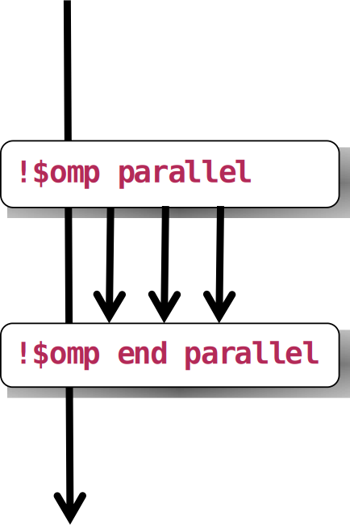
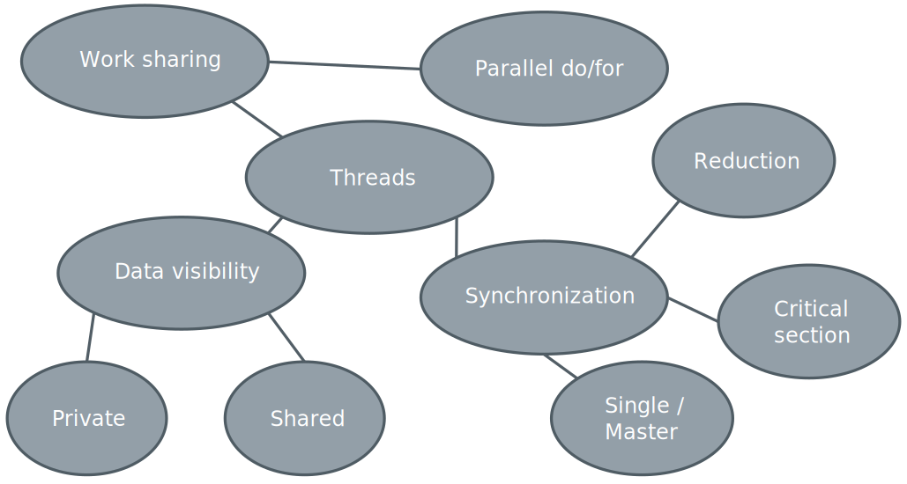
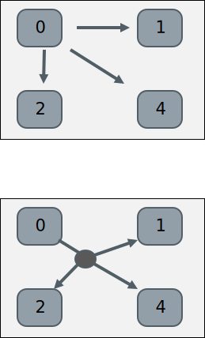
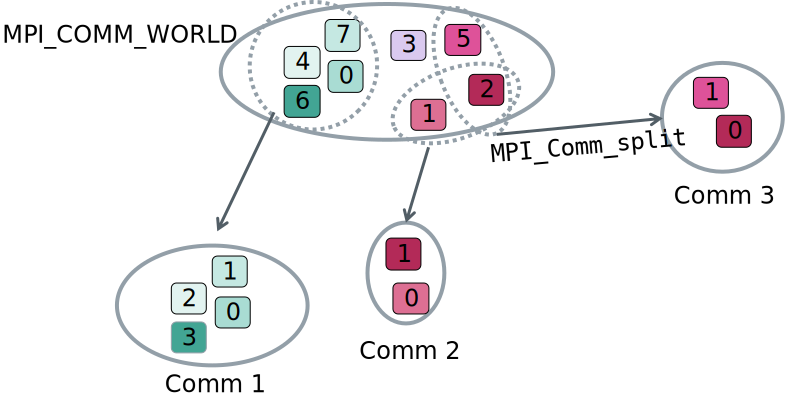
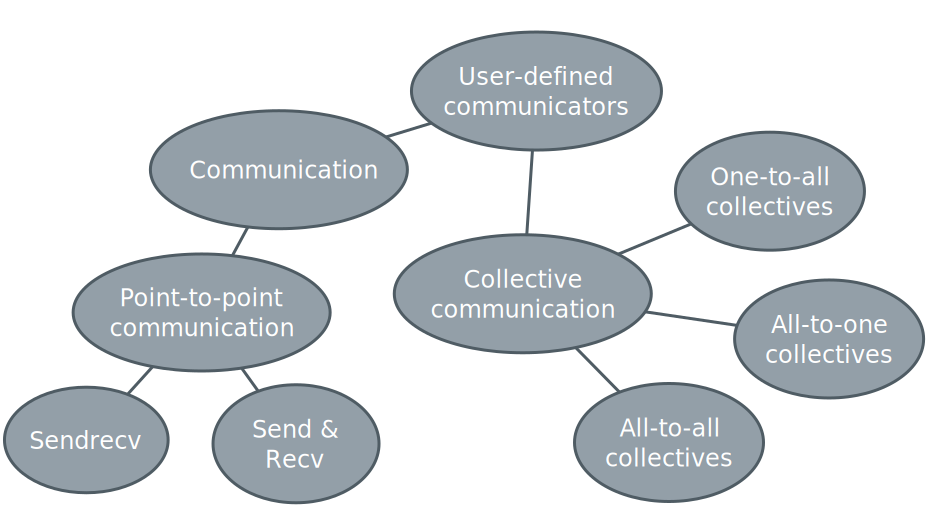

# Processes and threads

{width=90%}

<div class="column">

## Process

- Independent execution units
- Have their own state information and *own memory* address space

</div>

<div class="column">

## Thread

- A single process may contain multiple threads
- Have their own state information, but *share* the *same memory*
  address space

</div>


# Processes and threads

{width=90%}

<div class="column">
## Process

- Long-lived: spawned when parallel program started, killed when
  program is finished
- Explicit communication between processes

</div>

<div class="column">

## Thread

- Short-lived: created when entering a parallel region, destroyed
  (joined) when region ends
- Communication through shared memory

</div>


# OpenMP walkthrough {.section}

# Three components of OpenMP

- Compiler directives and constructs
    - Expresses shared memory parallelization
    - Preceded by sentinel, can compile serial version

- Runtime library routines
    - Small number of library functions
    - Can be discarded in serial version via conditional compiling

- Environment variables
    - Specify the number of threads, etc.

# OpenMP directives

- Sentinels precede each OpenMP directive
   - C/C++: `#pragma omp`
   - Fortran free form: `!$omp`

- Compilers that support OpenMP usually require an option (flag) that
  enables the feature
    - Without an enabling flag the OpenMP sentinels are treated as
      comments and a serial version will be compiled

# Parallel construct

<div class="column">

- Defines a *parallel region*
    - Prior to it only one thread, master
    - Creates a team of threads: master+slave threads
    - At end of the block is a barrier and all shared data is synchronized

```fortran
!$omp parallel

!$omp end parallel
```

</div>

<div class="column">

{width=50%}

</div>

# Example: Helloworld with OpenMP

<div class="column">
```fortran
program hello
use omp_lib

integer :: omp_rank

!$omp parallel private(omp_rank)
omp_rank = omp_get_thread_num()
print *, 'Hello world! by & thread ', omp_rank
!$omp end parallel


end program hello
```

</div>
<div class="column">
```c
#include <stdio.h>
#include <omp.h>

int main(int argc, char argv[]) {
  int omp_rank;

  #pragma omp parallel private(omp_rank)
  {
  omp_rank = omp_get_thread_num();
  printf("Hello world! by thread %d", omp_rank);
  }
}
```
</div>

# Example: Helloworld with OpenMP

<div class="column">
```console
> ftn omp_hello.f90 -o omp
> aprun -e OMP_NUM_THREADS=4 -n 1 -d 4 ./omp

Hello world! by thread 0
Hello world! by thread 2
Hello world! by thread 1
Hello world! by thread 3
```
</div>
<div class="column">
```console
> cc omp_hello.c -o omp
> aprun -e OMP_NUM_THREADS=4 -n 1 -d 4 ./omp

Hello world! by thread 2
Hello world! by thread 3
Hello world! by thread 0
Hello world! by thread 1
```
</div>

# How do the threads interact?

- Because of the shared address space threads can "communicate" using
  *shared* variables
- Threads often need some *private* work space together with shared
  variables   
    - For example the index variable of a loop
- Visibility of different variables is defined using *data-sharing
  clauses* in the parallel region definition
    - `private`, `firstprivate`, `lastprivate`, `shared`, `default`
    - Local variables defined in the parallel region, or functions called
      within it are private

# Work sharing

- Parallel region creates an "Single Program Multiple Data" instance where
  each thread executes the same code
- How can one split the work between the threads of a parallel region?
    - Loop construct
    - Single/Master construct
    - Sections
    - Task construct

# Loop constructs

- Directive instructing compiler to share the work of a loop
    - Fortran: `$OMP DO`
    - C/C++: `#pragma omp for`
    - Directive must be inside a parallel region
    - Can also be combined with parallel:
        - `$OMP PARALLEL DO`
        - `#pragma omp parallel for`
- Loop index is private by default
- Work sharing can be controlled using *schedule* clause
    - `static`, `dynamic`, `guided`, or `runtime`

# Reduction clause

`reduction(operator:var_list)`
  : Performs reduction on the (scalar) variables in list (sum, max, min,
    ...)

      - Private reduction variable is created for each thread's partial
        result
      - Private reduction variable is initialized to operator's initial
        value, e.g., 0 for sum
      - After parallel region the reduction operation is applied to private
        variables and **result is aggregated to the shared variable**

# Execution controls

- Sometimes a part of parallel region should be executed only by the
  master thread or by a single thread at time
    - I/O, initializations, updating global values, etc.
    - Remember the synchronization!
- OpenMP provides clauses for controlling the execution of code blocks
    - `barrier`
    - `master` & `single`
    - `critical`


# OpenMP summary

{width=80%}


# Getting started with MPI {.section}

# Message-passing interface

- MPI is an application programming interface (API) for communication
  between separate processes
    - The most popular *distributed* parallel computing method
    - MPI programs are portable and scalable
- MPI is flexible and comprehensive
    - Several communication methods and patterns
    - Parallel IO

- MPI standardization by MPI Forum
    - Latest version is 3.1, version 1.0 in 1994

# Execution model in MPI

- Parallel program is launched as set of *independent*, *identical
  processes*
    - The same program code and instructions
- MPI runtime assigns each process a *rank*
    - identification of the processes
    - Processes can perform different tasks and handle different data
      basing on their rank
    - Can reside in different nodes
- The way to launch parallel program is implementation dependent

# Communication

<div class="column">

- Data is local to the MPI processes
    - they need to *communicate* to coordinate work
- Point-to-point communication
    - Messages are sent between two processes
- Collective communication
    - Involving a number of processes at the same time

</div>

<div class="column">

{width=50%}

</div>

# MPI point-to-point operations

- One process *sends* a message to another process that *receives* it with
  `MPI_Send` and `MPI_Recv` routines
- Sends and receives in a program should match – one receive per send
- Each message (envelope) contains
    - The actual *data* that is to be sent
    - The *datatype* of each element of data
    - The *number of elements* the data consists of
    - An identification number for the message (*tag*)
    - The ranks of the *source* and *destination* process

# Non-blocking communication

- Non-blocking communication is usually the smarter way to do
  point-to-point communication in MPI
    - Enables some computing concurrently with communication
    - Avoids many common dead-lock situations

- Non-blocking communication realization
    - `MPI_Isend`
    - `MPI_Irecv`
    - `MPI_Wait` / `MPI_Waitall`


# Collective operations examples

{width=90%}

# MPI datatypes

- MPI has a number of predefined datatypes to represent data
- Each C or Fortran datatype has a corresponding MPI datatype
    - C examples: `MPI_INT` for `int` and `MPI_DOUBLE` for `double`
    - Fortran example: `MPI_INTEGER` for `integer`
- One can also define custom datatypes


# Communicators

{width=80%}

# Basic MPI summary

{width=80%}
